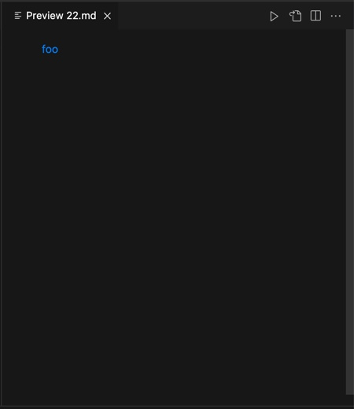

# Lab Report 5

>I first run the bash script in both Joe's version of MarkdownParse and my own MarkdownParse by using the following command:

            time bash script.sh>results.txt

>All the results are stores in results.txt in both folders. I then use the command to compare two results.txt:
            
            diff markdownparse1/results.txt markdownparse2/results.txt

>By doing this, I find two test files that two versions of MarkdownParse show different outputs.

 

## First test file: 22.md
>We first have a look at the contents of 22.md and the markdown preview:

>Apparently here, it is counted as a valid link by markdown. The following is the output of Joe's and my own MarkdownParse:

>My version of MarkdownParse gives the right output, while Joe's gives the wrong output. The reason for this is that in Joe's MarkdownParse, it checks the index of "". It returns the link only if the index of "" is -1. In other words, it returns the output only if there is no "" in the link. Therefore, the following part of code should be fixed to deal with the conditions that the links are valid with "". 

 

## Second test file: 578.md
>We first have a look at the contents of 578.md and the markdown preview:

>Apparently here, it is not counted as a valid link by markdown because there is a ! before brackets. It is counted as a picture. The following is the output of Joe's and my own MarkdownParse:

>My version of MarkdownParse gives the wrong output, while Joe's gives the right answer. The reason for this is that in my own MarkdownParse, I didn't check whether there is ! before brackets. Therefore, The following part should be refined so that it can deal with the condition about !.

